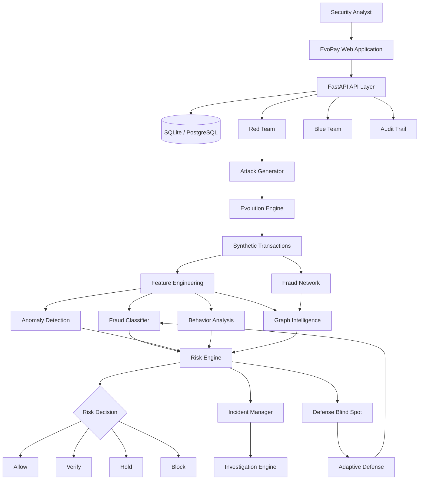
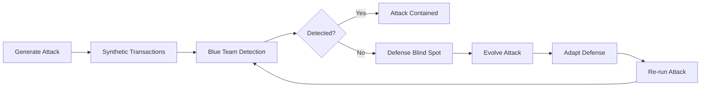

# EvoPay AI

### Adversarial AI for Payment Fraud Detection

EvoPay AI is a security research and simulation platform that models payment fraud as an **adversarial problem**.

Instead of testing a fraud detector only against known patterns, EvoPay introduces a controlled **Red Team vs Blue Team** loop: synthetic attacks are generated, evaluated against the detection system, evolved when they evade detection, and used to identify potential defense blind spots.

> **Fraud evolves. Your defense should too.**

---

## Overview

Generative AI can make fraudulent behavior easier to vary, automate, and scale. Traditional fraud systems are often evaluated against historical patterns, while adversarial attackers continuously change their behavior.

EvoPay explores a different approach:

```text
Generate Attack
      ↓
Generate Synthetic Transactions
      ↓
Run Detection
      ↓
Evaluate Evasion
      ↓
Identify Blind Spot
      ↓
Adapt Defense
      ↓
Re-run Attack
```

The entire environment uses **synthetic payment data** and is designed for controlled security experimentation. No real payment credentials or payment networks are involved.

---

## Key Features

### 🔴 Red Team

Generate controlled synthetic fraud scenarios across multiple attack categories.

Current attack scenarios include:

* Synthetic Identity
* Account Takeover
* Card Testing
* Money Mule
* Merchant Collusion
* Behavioral Mimicry
* Device Rotation
* Refund Abuse
* Velocity Attacks
* Composite Attacks

Generated attacks are passed through the same detection pipeline used for normal transactions.

---

### 🔵 Blue Team

Evaluate transactions using multiple independent signals rather than a single fraud score.

The detection layer combines:

* ML-based fraud probability
* Behavioral analysis
* Anomaly detection
* Payment-network relationships
* Transaction velocity
* Device and merchant relationships

The system produces a transparent risk score and recommended action.

```text
0–30    → ALLOW
31–60   → VERIFY
61–80   → HOLD
81–100  → BLOCK
```

---

### 🧠 Adaptive Defense

When an attack successfully evades detection, EvoPay records the event as a potential **Defense Blind Spot**.

The system can then use the missed scenario to update the defensive layer and re-run the attack.

This creates an iterative loop:

```text
Attack
  ↓
Detection
  ↓
Evasion
  ↓
Blind Spot
  ↓
Defense Adaptation
  ↓
Re-test
```

The objective is not simply to maximize detection, but to continuously test how the detector behaves against changing attack patterns.

---

### 🕸️ Fraud Network Intelligence

EvoPay models relationships between:

```text
Customer
   ↕
Account
   ↕
Device
   ↕
Merchant
   ↕
Transaction
   ↕
IP
```

Connected entities can reveal patterns that may not be visible from an individual transaction.

The network view helps investigate:

* Shared devices
* Connected accounts
* Merchant relationships
* Suspicious clusters
* High-risk neighbors
* Coordinated activity

---

## Architecture



---

## Adversarial Feedback Loop



---

## Detection Pipeline

Each transaction passes through multiple layers of analysis.

### 1. Transaction Features

The system extracts signals such as:

* Transaction amount
* Transaction velocity
* Account age
* Failed attempts
* Location changes
* Device changes
* Merchant frequency
* Historical spending behavior

### 2. ML Detection

A supervised fraud classifier estimates the probability that a transaction belongs to a fraudulent pattern.

### 3. Anomaly Detection

Unusual transactions are identified using behavioral deviation from normal payment activity.

### 4. Behavioral Analysis

Current activity is compared with historical customer behavior.

### 5. Graph Intelligence

Relationships between accounts, devices, merchants, and transactions are evaluated for coordinated risk.

### 6. Risk Engine

The individual signals are combined into a final risk score.

---

## Synthetic Attack Library

| Attack             | Primary Signal                                |
| ------------------ | --------------------------------------------- |
| Synthetic Identity | New identity + unusual behavior               |
| Account Takeover   | Behavioral/location deviation                 |
| Card Testing       | High velocity + repeated failures             |
| Money Mule         | Coordinated account relationships             |
| Merchant Collusion | Suspicious merchant graph                     |
| Behavioral Mimicry | Fraud behavior resembling legitimate activity |
| Device Rotation    | Multiple devices/accounts                     |
| Refund Abuse       | Abnormal refund patterns                      |
| Velocity Attack    | High transaction frequency                    |
| Composite Attack   | Multiple attack patterns                      |

---

## Product Screens

### Command Center


Central view of transaction activity, risk levels, incidents and system activity.

### Red Team Lab


Controlled generation and evolution of synthetic payment attacks.

### Blue Team


Transaction-level risk analysis and mitigation decisions.

### Fraud Network


Relationship graph for investigating connected entities and suspicious clusters.

### Adversarial Arena


Red Team vs Blue Team simulation showing detection, evasion and defense adaptation.

> Screenshots in this section should always represent the current running version of the application.

---

## Tech Stack

### Frontend

* React
* TypeScript
* Vite
* Tailwind CSS
* Framer Motion
* Recharts
* Lucide React

### Backend

* Python
* FastAPI
* Pydantic
* SQLAlchemy

### Data & ML

* Python
* Pandas
* NumPy
* Scikit-learn
* XGBoost
* NetworkX

### Database

* SQLite for local development
* PostgreSQL-compatible configuration for deployment

### Deployment

* Vercel — Frontend
* Render — Backend

---

## Project Structure

```text
evopay/
│
├── frontend/
│   ├── src/
│   │   ├── components/
│   │   ├── pages/
│   │   ├── hooks/
│   │   ├── lib/
│   │   └── App.tsx
│   ├── package.json
│   └── vite.config.ts
│
├── backend/
│   ├── routers/
│   ├── services/
│   ├── ml/
│   ├── models.py
│   ├── schemas.py
│   ├── database.py
│   └── main.py
│
├── docs/
│   ├── screenshots/
│   └── ARCHITECTURE.md
│
├── .env.example
├── .gitignore
├── README.md
└── DEPLOYMENT.md
```

*Update this tree to match the actual repository structure.*

---

## Getting Started

### Prerequisites

* Node.js 18+
* Python 3.10+
* Git

### Clone

```bash
git clone https://github.com/oindreela04/evopay.git
cd evopay
```

### Backend

```bash
cd backend

python -m venv venv
```

Windows:

```bash
venv\Scripts\activate
```

macOS/Linux:

```bash
source venv/bin/activate
```

Install dependencies:

```bash
pip install -r requirements.txt
```

Initialize the database:

```bash
python init_db.py
```

Start the API:

```bash
uvicorn main:app --reload
```

Backend:

```text
http://localhost:8000
```

API documentation:

```text
http://localhost:8000/docs
```

---

### Frontend

Open another terminal:

```bash
cd frontend
npm install
npm run dev
```

Frontend:

```text
http://localhost:5173
```

---

## Model Training

If the ML pipeline is enabled:

```bash
cd backend

python ml/train.py
```

Evaluate:

```bash
python ml/evaluate.py
```

The training pipeline should generate model artifacts used by the inference layer.

All evaluation numbers shown in the project should come from actual model evaluation rather than manually entered values.

---

## API

Core endpoints:

| Method | Endpoint                         | Purpose             |
| ------ | -------------------------------- | ------------------- |
| GET    | `/api/health`                    | API health          |
| GET    | `/api/dashboard`                 | Dashboard data      |
| GET    | `/api/transactions`              | Transaction list    |
| GET    | `/api/transactions/{id}`         | Transaction details |
| POST   | `/api/transactions/{id}/analyze` | Analyze transaction |
| POST   | `/api/transactions/{id}/action`  | Apply mitigation    |
| GET    | `/api/attacks`                   | Attack history      |
| POST   | `/api/attacks/generate`          | Generate attack     |
| POST   | `/api/attacks/evolve`            | Evolve attack       |
| GET    | `/api/network`                   | Fraud network       |
| POST   | `/api/simulation/start`          | Start simulation    |
| GET    | `/api/incidents`                 | Security incidents  |
| GET    | `/api/analytics`                 | Security analytics  |
| POST   | `/api/investigate`               | Investigate event   |
| POST   | `/api/defense/adapt`             | Adapt defense       |

Only expose/document endpoints that are actually implemented.

---

## Security Model

EvoPay is intentionally isolated from real payment infrastructure.

* All transactions are synthetic.
* No real card numbers are stored.
* No real payment credentials are processed.
* No real payment network is connected.
* Attack generation occurs inside a controlled simulation.
* AI-generated explanations cannot directly authorize payment actions.
* Security decisions are made by deterministic application logic.

---

## Evaluation

EvoPay should be evaluated on more than classification accuracy.

### Detection

* Precision
* Recall
* F1
* PR-AUC
* ROC-AUC
* False Positive Rate

### Adversarial Performance

* Attack diversity
* Attack realism
* Detection rate
* Evasion rate
* Time to detection
* Defense improvement after adaptation

### System Performance

* API latency
* Simulation runtime
* Model inference time
* Network-analysis performance

Only publish measured values from the current implementation.

---

## Deployment

### Frontend

Deploy the `frontend` directory to Vercel.

Configure:

```env
VITE_API_URL=https://your-backend-url
```

### Backend

Deploy the `backend` directory to Render.

Configure:

```env
PORT=10000
DATABASE_URL=...
```

Configure CORS to allow requests from the deployed Vercel application.

See [`DEPLOYMENT.md`](DEPLOYMENT.md) for the complete deployment procedure.

---

## Demo Flow

A short demonstration should follow the adversarial loop:

```text
01  Command Center
        ↓
02  Generate Red Team Attack
        ↓
03  Inspect Synthetic Transactions
        ↓
04  Investigate Fraud Network
        ↓
05  Run Blue Team Detection
        ↓
06  Show Risk Breakdown
        ↓
07  Block High-Risk Transaction
        ↓
08  Create Incident
        ↓
09  Evolve Attack
        ↓
10  Discover Defense Blind Spot
        ↓
11  Adapt Defense
        ↓
12  Re-run Attack
        ↓
13  Compare Detection Before/After
```

### The key moment

The strongest part of the demonstration is not simply showing that EvoPay detects fraud.

It is showing:

> **The attack changes → the defense is challenged → a blind spot is found → the defense adapts → the attack is tested again.**

---

<p align="center">
  <strong>EvoPay AI</strong><br>
  Adversarial testing for evolving payment fraud.
</p>
